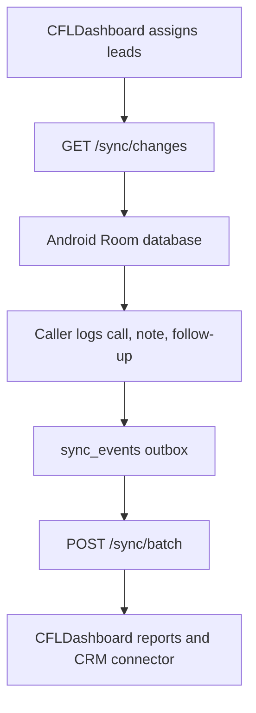

# CFLDashboard connector

CallFlow Android connects to dashboards through one stable backend contract. CFLDashboard should implement this contract and act as the primary dashboard/backend. Future dashboards can be connected by implementing the same routes and payloads, without changing the Android CRM logic.

## Android build configuration

Development fake mode stays enabled by default. To point the app at CFLDashboard:

```bash
./gradlew assembleDebug \
  -Pcallflow.useFakeBackend=false \
  -Pcallflow.apiBaseUrl=https://your-cfl-dashboard.example.com/api/ \
  -Pcallflow.dashboardConnectorId=cfl-dashboard
```

`callflow.apiBaseUrl` must end with `/` because Retrofit resolves relative API paths against it.

## Local CFLDashboard API

This repository includes a small local CFLDashboard-compatible API for development:

```bash
python3 cfl-dashboard-server/server.py --host 0.0.0.0 --port 8010
```

For an Android emulator, build the app with:

```bash
./gradlew assembleDebug \
  -Pcallflow.useFakeBackend=false \
  -Pcallflow.apiBaseUrl=http://10.0.2.2:8010/ \
  -Pcallflow.dashboardConnectorId=cfl-dashboard
```

For a physical phone on the same Wi-Fi network, replace `10.0.2.2` with the Mac's LAN IP address.

The local API accepts any identity with password `1234`.

Every API request includes:

```text
X-CallFlow-Client: android
X-CallFlow-Connector: cfl-dashboard
Authorization: Bearer <access-token>
```

The connector id can be changed per dashboard, for example `custom-dashboard`, while the Android endpoint contract remains the same.

## Required CFLDashboard routes

```text
POST /auth/login
POST /auth/refresh
POST /devices/register
GET  /crm/status
POST /sync/batch
GET  /sync/changes?cursor=<opaque-cursor>
```

The existing Android app already calls these routes through `CallFlowApi`.

## Connector status

`GET /crm/status` lets the app and support team verify which dashboard is active.

```json
{
  "connectorId": "cfl-dashboard",
  "dashboardName": "CFLDashboard",
  "status": "CONNECTED",
  "syncDirection": "TWO_WAY",
  "lastSuccessfulSyncAt": "2026-08-20T10:00:00Z",
  "capabilities": [
    "LEAD_PULL",
    "CALL_PUSH",
    "NOTE_PUSH",
    "FOLLOW_UP_PUSH",
    "DISPOSITION_PUSH"
  ]
}
```

Supported statuses:

```text
CONNECTED
DEGRADED
DISCONNECTED
AUTH_REQUIRED
```

## Sync model

CFLDashboard is server-authoritative for users, assignments, campaign membership, and CRM/dashboard ids. Android is allowed to create offline call, note, disposition, and follow-up events. Android writes local rows first, then sends durable outbox events through `POST /sync/batch`.



## Batch sync request

```json
{
  "deviceId": "android-device-id",
  "lastSyncCursor": "opaque-cursor-or-null",
  "events": [
    {
      "eventUuid": "uuid",
      "entityType": "CALL",
      "entityId": "local-call-id",
      "operation": "CREATE",
      "payload": {
        "raw": "{\"callId\":\"local-call-id\",\"leadId\":\"lead-id\"}"
      }
    }
  ]
}
```

Response:

```json
{
  "acceptedEventIds": ["uuid"],
  "failedEventIds": [],
  "nextSyncCursor": "opaque-next-cursor",
  "serverTimestamp": "2026-08-20T10:01:00Z"
}
```

Accepted ids must match `eventUuid`, not local database row ids.

## Pull changes response

`GET /sync/changes` returns dashboard changes since the provided cursor. Cursors are opaque and generated only by CFLDashboard.

Required top-level response shape:

```json
{
  "leads": [],
  "calls": [],
  "callEvents": [],
  "notes": [],
  "followUps": [],
  "leadStages": [],
  "dispositions": [],
  "appConfiguration": [],
  "deletedLeadIds": [],
  "deletedFollowUpIds": [],
  "nextCursor": "opaque-next-cursor",
  "serverTimestamp": "2026-08-20T10:01:00Z"
}
```

## Dashboard responsibilities

CFLDashboard should handle:

- OAuth or API credentials for any external CRM.
- Field mapping between CallFlow fields and CRM/dashboard fields.
- Rate limits, retries, and connector errors.
- User/team authorization and lead assignment.
- Conflict handling for versioned entities.
- Reporting for calls, outcomes, follow-ups, pending sync, and per-user performance.

Android should not store third-party CRM tokens or implement CRM-specific APIs directly.
